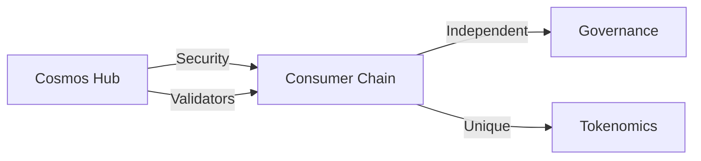
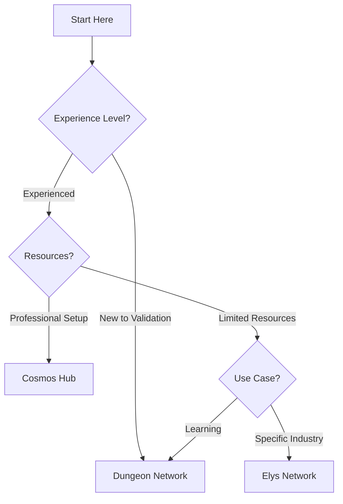

# Network Types Overview

Welcome to our comprehensive guide on Cosmos ecosystem networks! Understand the different types of networks available for validation and choose the one that best suits your goals.

## Table of Contents
- [Understanding Network Types](#understanding-network-types)
- [Network Comparison](#network-comparison)
- [Making the Right Choice](#making-the-right-choice)
- [Network-Specific Guides](#network-specific-guides)
- [Resources & Support](#resources--support)

## Understanding Network Types 🌐

### Cosmos Hub (Main Network)

The flagship of the Cosmos ecosystem, Cosmos Hub serves as:
- Primary hub for inter-blockchain communication
- Security provider for the ecosystem
- Gateway for cross-chain transactions
- Governance center for major decisions

#### Key Features
- Production-grade environment
- High-value transactions
- Professional validator requirements
- Core governance responsibilities

#### Technical Specifications
```
Minimum Requirements:
- CPU: 8 cores/16 threads
- RAM: 64GB
- Storage: 4TB NVMe SSD
- Bandwidth: 1Gbps
- Uptime: 99.9%+
```

[Detailed Cosmos Hub Guide →](./cosmos-hub/README.md)

### ICS (Inter-Chain Security) Networks

ICS revolutionizes blockchain security by allowing chains to:
- Share security with Cosmos Hub
- Benefit from established validator set
- Maintain independent governance
- Operate cost-effectively

#### How ICS Works


#### Available ICS Networks

##### 1. Dungeon Network
Perfect for learning and testing:
- Lower entry barriers
- Educational focus
- Community support
- Experimental features

[Explore Dungeon Network →](./ics-networks/dungeon/README.md)

##### 2. Elys Network
Specialized blockchain applications:
- Industry-specific features
- Custom parameters
- Optimized performance
- Focused use cases

[Discover Elys Network →](./ics-networks/elys/README.md)

## Network Comparison 📊

### Technical Requirements

| Requirement | Cosmos Hub | Dungeon | Elys |
|------------|------------|----------|------|
| CPU Cores | 8+ | 4+ | 6+ |
| RAM | 64GB+ | 32GB | 32GB+ |
| Storage | 4TB+ | 2TB | 2TB+ |
| Bandwidth | 1Gbps | 100Mbps | 500Mbps |
| Uptime | 99.9%+ | 98%+ | 99%+ |

### Operational Aspects

| Aspect | Cosmos Hub | ICS Networks |
|--------|------------|--------------|
| Security | Self-managed | Shared |
| Stake Required | High | Lower |
| Technical Expertise | Advanced | Intermediate |
| Risk Level | Higher | Moderate |
| Reward Potential | Higher | Variable |

## Making the Right Choice 🎯

### Decision Flowchart


### Consider These Factors
1. **Experience Level**
   - New to validation?
   - Technical expertise
   - Operational experience

2. **Resources Available**
   - Infrastructure
   - Financial capacity
   - Time commitment
   - Team size

3. **Goals**
   - Learning and development
   - Professional operation
   - Industry specialization
   - Community participation

## Network-Specific Guides

### Cosmos Hub
- [Complete Guide](./cosmoshub/README.md)
- [Setup Instructions](./cosmoshub/setup.md)
- [Maintenance Guide](./cosmoshub/maintenance.md)

### ICS Networks
- [Dungeon Network Guide](./ics-networks/dungeon/README.md)
- [Elys Network Guide](./ics-networks/elys/README.md)

## Resources & Support 🤝

### Documentation
- [Cosmos Hub Docs](https://hub.cosmos.network/main/validators/overview.html)
- [ICS Documentation]((https://docs.cosmos.network/main/learn/intro/overview))

### Community
- [Discord](https://discord.gg/tZW4xf3c2D)
- [Telegram](https://t.me/quasarstakingeng)
- Technical Support: [@whtech_support](https://t.me/whtech_support)

## FAQ ❓

### Which network is best for beginners?
Start with Dungeon Network for:
- Lower stakes
- Community support
- Learning environment
- Forgiving parameters

### How to migrate between networks?
1. Build experience on Dungeon
2. Establish track record
3. Gradually upgrade infrastructure
4. Move to Cosmos Hub or Elys

### What are the key differences in practice?
- **Cosmos Hub**: Production environment, high stakes, professional operation
- **Dungeon**: Learning environment, community focus, lower requirements
- **Elys**: Specialized features, industry focus, moderate requirements

---

*Maintained by Quasar - Your Network Navigation Experts*

💡 **Pro Tip**: Your choice of network should align with your goals, resources, and experience level. Start where you're comfortable and grow from there!
