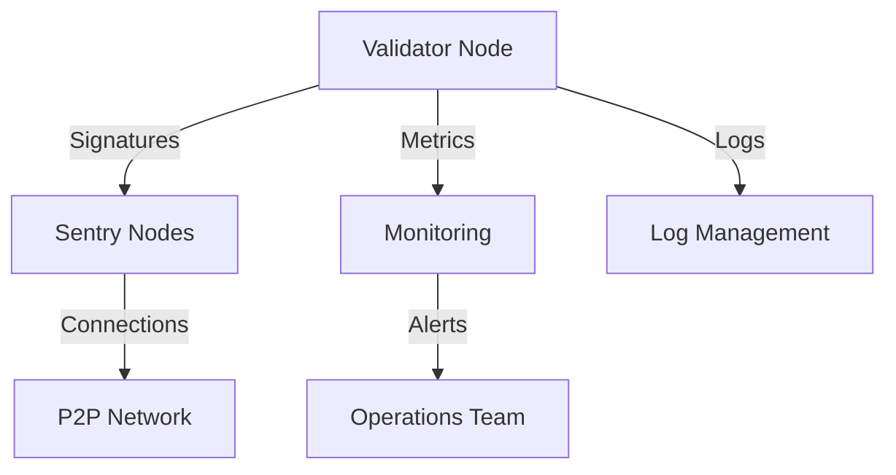

# Cosmos Hub Validator Guide

Welcome to the Cosmos Hub validator guide. As the flagship chain of the Cosmos ecosystem, Cosmos Hub maintains the highest standards for validators. This guide will help you understand and meet these requirements.

## Table of Contents
- [Overview](#overview)
- [Requirements](#requirements)
- [Architecture](#architecture)
- [Getting Started](#getting-started)
- [Operation Guide](#operation-guide)
- [Best Practices](#best-practices)
- [Advanced Topics](#advanced-topics)

## Overview 🌟

### What is Cosmos Hub?
Cosmos Hub (ATOM) is the first blockchain in the Cosmos Network:
- Primary hub for IBC communications
- Security provider for ICS networks
- Economic center of Cosmos ecosystem
- Governance hub for major decisions

### Key Statistics
```
Network Details:
- Chain ID: cosmoshub-4
- Token: ATOM
- Active Validators: 150
- Average Block Time: ~6.5 seconds
- Annual Inflation: 7-20%
```

## Requirements 💻

### Hardware Specifications
```
Production Requirements:
CPU: 
  - Minimum: 8 cores/16 threads
  - Recommended: 16 cores/32 threads
  - Example: AMD Ryzen 9 5950X or Intel Xeon

RAM:
  - Minimum: 64GB
  - Recommended: 128GB
  - Type: ECC Memory preferred

Storage:
  - Minimum: 1TB NVMe SSD
  - Recommended: 8TB NVMe SSD
  - RAID Configuration: Optional but recommended

Network:
  - Minimum: 1Gbps
  - Recommended: 2Gbps
  - Monthly Transfer: 10TB+
```

### Software Requirements
```bash
# Operating System
Ubuntu 22.04 LTS or higher

# Required Software
- Go 1.23+
- Cosmovisor
- Gaia
- Monitoring tools
```

### Financial Requirements
```
Initial Investment:
- Server Costs: $300-500/month
- Self-Stake: Variable (significant ATOM amount)
- Security Setup: $1000-2000
- Monitoring: $100-200/month
```

## Architecture 🏗️

### High-Level Design


### Network Architecture
```
┌─────────────────┐
│  Validator Node │
└────────┬────────┘
         │
    ┌────┴────┐
    │Firewall │
    └────┬────┘
         │
┌────────┴─────────┐
│   Sentry Nodes   │
└────────┬─────────┘
         │
┌────────┴─────────┐
│  Cosmos Network  │
└──────────────────┘
```

## Getting Started 🚀

Detailed in [setup.md](./setup.md)

### Maintenance Procedures
Detailed in [maintenance.md](./maintenance.md)

## Best Practices 📚

### Security
1. **Network Security**
   - Use dedicated servers
   - Implement sentry nodes
   - Regular security audits
   - DDoS protection

2. **Key Management**
   - Hardware security modules
   - Secure key generation
   - Regular key rotation
   - Backup procedures

### Monitoring
1. **Essential Metrics**
   - Block signing rate
   - Network connectivity
   - System resources
   - Chain sync status

2. **Alert Setup**
   - Missed blocks
   - Resource utilization
   - Network issues
   - Security events

## Advanced Topics 🔬

### High Availability
```
Primary DC      Backup DC
┌─────────┐    ┌─────────┐
│Validator│    │Validator│
└────┬────┘    └────┬────┘
     │              │
┌────┴────┐    ┌────┴────┐
│ Sentry  │    │ Sentry  │
└─────────┘    └─────────┘
```

### Performance Optimization
1. **Database Tuning**
   ```bash
   # Example config
   db_backend = "goleveldb"
   db_dir = "data"
   ```

2. **Network Tuning**
   ```bash
   # /etc/sysctl.conf
   net.core.rmem_max=2097152
   net.core.wmem_max=2097152
   ```

## Resources & Support 🤝

### Documentation
- [Official Docs](https://hub.cosmos.network)
- [Technical Specs](./technical-specs.md)
- [FAQ](./faq.md)

### Support Channels
- Discord: [Join](https://discord.gg/tZW4xf3c2D)
- Telegram: [@quasarstakingeng](https://t.me/quasarstakingeng)
- Technical Support: [@whtech_support](https://t.me/whtech_support)

## FAQ ❓

### How much ATOM do I need?
The required amount varies. Monitor the active set and aim for a competitive self-stake.

### How long until profitable?
Consider:
- Infrastructure costs
- Competition level
- Market conditions
- Operation efficiency

### What about downtime?
- Maximum 5% missed blocks
- Use monitoring tools
- Implement alerting
- Have backup systems

---

*Maintained by Quasar - Professional Cosmos Hub Validators*

💡 **Pro Tip**: Success in Cosmos Hub validation comes from meticulous attention to detail and proactive management. Start with proper infrastructure and grow your operation systematically!