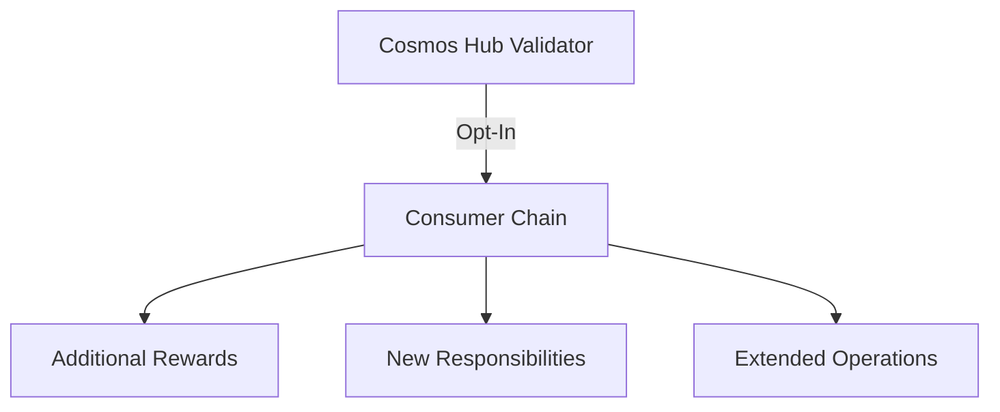

# ICS Networks Guide


Welcome to the comprehensive guide on Inter-Chain Security (ICS) networks in the Cosmos ecosystem. Learn how to participate in ICS networks as a Cosmos Hub validator.

## Table of Contents
- [Understanding ICS](#understanding-ics)
- [Participation Process](#participation-process)
- [Opt-In Guide](#opt-in-guide)
- [Opt-Out Process](#opt-out-process)
- [Network Management](#network-management)
- [Troubleshooting](#troubleshooting)

## Understanding ICS 🌐

### What is Inter-Chain Security?
ICS allows Cosmos Hub validators to:
- Secure multiple chains simultaneously
- Earn additional rewards
- Expand validator operations
- Support ecosystem growth

### Benefits
- Additional revenue streams
- Lower operational overhead
- Increased network utility
- Community expansion

## Participation Process 🔄

### Prerequisites
- Active Cosmos Hub validator
- Good standing (no recent slashing)
- Technical readiness
- Resource availability

### Available Networks
1. **Dungeon Network**
   - Testing environment
   - Learning platform
   - Community focus

2. **Elys Network**
   - Specialized features
   - Custom applications
   - Industry solutions

## Opt-In Guide 📥

### Understanding Opt-In


### Step-by-Step Opt-In Process

#### 1. Check Eligibility
```bash
# Check validator status
gaiad query staking validator $(gaiad tendermint show-validator)

# Verify no recent slashing
gaiad query slashing signing-info $(gaiad tendermint show-validator)
```

#### 2. Prepare for Opt-In
```bash
# Update Gaia to required version
git checkout <required-version>
make install

# Verify binary version
gaiad version
```

#### 3. Submit Opt-In Transaction
```bash
# Format
gaiad tx provider consumer-addition <chain-id> --from <key> --chain-id cosmoshub-4

# Example for Dungeon
gaiad tx provider consumer-addition dungeon-1 \
  --from validator \
  --chain-id cosmoshub-4 \
  --gas auto \
  --gas-adjustment 1.3
```

#### 4. Verify Participation
```bash
# Check consumer chain assignment
gaiad query provider validator-consumer-assignment $(gaiad tendermint show-validator)

# Monitor signing status
gaiad query provider consumer-validator-assignment <chain-id>
```

## Opt-Out Process 📤

### When to Opt-Out
- Resource constraints
- Technical issues
- Strategic decisions
- Maintenance needs

### Step-by-Step Opt-Out Process

#### 1. Prepare for Opt-Out
```bash
# Check current assignments
gaiad query provider validator-consumer-assignment <valoper-address>
```

#### 2. Submit Opt-Out Transaction
```bash
# Format
gaiad tx provider consumer-removal <chain-id> --from <key> --chain-id cosmoshub-4

# Example
gaiad tx provider consumer-removal dungeon-1 \
  --from validator \
  --chain-id cosmoshub-4 \
  --gas auto \
  --gas-adjustment 1.3
```

#### 3. Verify Opt-Out
```bash
# Confirm removal
gaiad query provider validator-consumer-assignment $(gaiad tendermint show-validator)
```

## Network Management 🔧

### Resource Planning
```
Additional Requirements per Network:
- CPU: +2 cores
- RAM: +8GB
- Storage: +500GB
- Bandwidth: +100Mbps
```

### Monitoring Setup
1. **Add Metrics**
   ```yaml
   # prometheus.yml
   scrape_configs:
     - job_name: 'consumer-chain'
       static_configs:
         - targets: ['localhost:26660']
   ```

2. **Configure Alerts**
   ```yaml
   # alerts.yml
   groups:
     - name: consumer-chain
       rules:
         - alert: ConsumerChainDown
           expr: up == 0
   ```

## Troubleshooting 🔍

### Common Issues

#### 1. Opt-In Failed
```bash
# Check transaction status
gaiad query tx <tx-hash>

# Common solutions:
1. Verify validator status
2. Check gas settings
3. Confirm chain-id
```

#### 2. Signing Issues
```bash
# Check signing status
gaiad query slashing signing-info $(gaiad tendermint show-validator)

# Monitor blocks
gaiad query provider consumer-validator-assignment <chain-id>
```

## Best Practices 📚

### Successful Participation
✅ Start with test networks
✅ Monitor resources carefully
✅ Maintain backup systems
✅ Keep software updated
✅ Follow security guidelines

### Resource Management
1. Monitor per network:
   - CPU usage
   - Memory allocation
   - Disk space
   - Network bandwidth

2. Set alerts for:
   - Resource limits
   - Signing issues
   - Network problems
   - Software updates

## Support & Resources 🤝

### Documentation
- [Official ICS Docs](https://docs.cosmos.network/main/ics/overview)
- [Technical Specs](./technical-specs.md)
- [Network Guides](./networks/README.md)

### Community Support
- Discord: [Join](https://discord.gg/tZW4xf3c2D)
- Telegram: [@quasarstakingeng](https://t.me/quasarstakingeng)
- Technical Support: [@whtech_support](https://t.me/whtech_support)

## FAQ ❓

### Can I opt-in to multiple networks?
Yes, as long as you have sufficient resources for each network.

### What happens after opt-in?
You'll automatically start validating the consumer chain and earning additional rewards.

### Can I opt-out at any time?
Yes, but follow the proper procedure to avoid issues.

---

*Maintained by Quasar - Experts in ICS Network Validation*

💡 **Pro Tip**: Always test your setup with smaller networks before committing to major consumer chains!