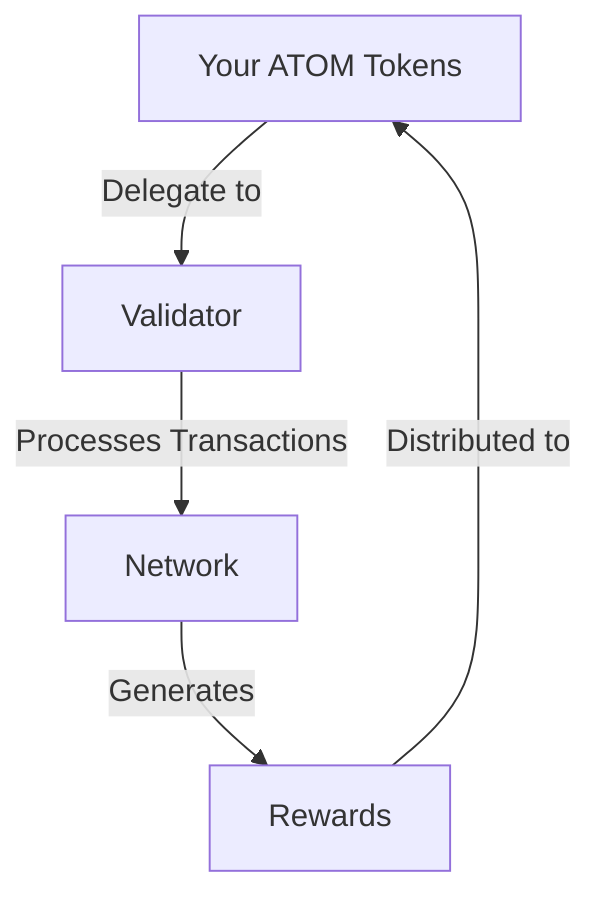

# Complete Staking Guide

Welcome to the comprehensive guide on staking in the Cosmos ecosystem. Learn how to earn rewards while securing the network with Quasar - the first AI-powered validator.

## Table of Contents
- [What is Staking?](##what-is-staking)
- [Why Should You Stake?](#why-should-you-stake)
- [How Staking Works](#how-staking-works)
- [Wallet Setup](#wallet-setup)
- [How to Start Staking](#how-to-start-staking)
- [Managing Your Stake](#managing-your-stake)
- [Rewards & Risks](#rewards--risks)
- [Resources & Support](#resources--support)

## What is Staking? 🌟

### Simple Explanation
Think of staking like putting money in a savings account that helps run the network:
- You "lock" your ATOM tokens with a validator
- Your tokens help secure and operate the network
- You earn rewards (like interest) for participating
- You can unstake anytime (with a 21-day waiting period)

## Why Should You Stake? 💰

### 1. Earn Passive Income
- Regular rewards (currently ~8-20% annual return)
- Daily reward distributions
- Compound your earnings by restaking

### 2. Support the Network
- Help secure the blockchain
- Enable faster transactions
- Support network stability
- Participate in ecosystem growth

### 3. Participate in Governance
- Vote on network changes
- Influence future development
- Have your say in important decisions
- Shape the ecosystem's future

## How Staking Works 🔄



### Important Things to Know
- Start earning immediately
- Rewards distributed every block
- 21-day unbonding period
- Keep full ownership of tokens
- Can redelegate to different validator
- Participate in governance decisions

## Wallet Setup 🔐

The following wallets are community-maintained and listed in the official Cosmos documentation. They allow you to store & transfer ATOM, delegate to validators, and vote on governance proposals. Note that we do not endorse any of the wallets; they are listed for your convenience.

### Web/Desktop Wallets
- **Keplr** - Web
- **Leap Wallet** - Web
- **Math Wallet** - Web
- **Atomic Wallet** - Linux, macOS, Windows

### Mobile Wallets
- **Cosmostation** - Android, iOS
- **Leap Wallet** - Android, iOS
- **Trust Wallet** - Android, iOS
- **Crypto.com** - Android, iOS
- **Citadel.One** - Android, iOS
- **Cobo** - Android, iOS
- **Huobi Wallet** - Android, iOS
- **imToken** - Android, iOS
- **Math Wallet** - Android, iOS
- **Rainbow Wallet** - Android, iOS
- **ShapeShift** - Android, iOS

### Hardware Wallets
- **Ledger** - Most secure option for storing keys

### Additional Options
- **Komodo Wallet**

### Security Recommendations
- Use hardware wallets for maximum security
- Only download wallets from official sources
- Never share your seed phrase
- Keep your software updated
- Use strong passwords
- Enable 2FA where available

## How to Start Staking 🚀

### Step 1: Get a Wallet
Choose and set up a wallet from our trusted list above. We recommend Keplr (web) or Ledger (hardware) for beginners.

### Step 2: Get ATOM
1. Buy ATOM from an exchange (Binance, Coinbase, etc.)
2. Transfer to your wallet
3. Keep small amount (~0.1 ATOM) for fees

### Step 3: Choose Your Validator
We recommend Quasar for:
- AI-powered security
- Professional management
- Strong community support
- Reliable performance

Quasar Validator Details:
```
Address: cosmosvaloper14yncgrhz5t0j6p9yfm0eht65ltter2kqwkn6dc
Commission: Competitive rate
Uptime: 99.9%+
Security: AI-enhanced
```

### Step 4: Delegate Your Tokens

#### Using Keplr Wallet:
1. Go to [wallet.keplr.app](https://wallet.keplr.app)
2. Connect your wallet
3. Click 'Stake'
4. Find Quasar or use our address
5. Enter amount to stake
6. Click 'Delegate'
7. Approve transaction

#### Using Ledger:
1. Connect your Ledger
2. Open Cosmos app
3. Follow Keplr steps above
4. Confirm on device

## Managing Your Stake 📊

### Monitoring
1. **Check Rewards**
   - View in wallet
   - Track daily earnings
   - Monitor validator performance

2. **Claim Rewards**
   - Collect anytime
   - Reinvest for compounding
   - Keep some for fees

### Common Operations
- **Redelegate**: Change validator without waiting period
- **Claim Rewards**: Collect earned tokens
- **Reinvest**: Compound your earnings
- **Undelegate**: 21-day unbonding period

## Rewards & Risks 💡

### Rewards
- 8-20% annual returns (variable)
- Daily distributions
- Extra rewards from network growth
- Governance voting rights

### Risks
- 21-day unbonding period
- No rewards during unbonding
- Small slashing risk if validator misbehaves
- Market price fluctuations

### Best Practices
- Start with a small amount
- Monitor your validator
- Regularly claim rewards
- Stay informed about updates
- Participate in governance

## Support & Resources 🤝

### Get Help
- Discord: [Join](https://discord.gg/tZW4xf3c2D)
- Telegram: [@quasarstakingeng](https://t.me/quasarstakingeng)
- Technical Support: [@whtech_support](https://t.me/whtech_support)

### Learn More
- [Official Cosmos Documentation](https://hub.cosmos.network)
- [Quasar Website](https://quasarstaking.ai)
- [Staking Calculator](https://www.stakingrewards.com)

---

*Maintained by Quasar - Your AI-Powered Staking Partner*

💡 **Pro Tip**: Start with a small amount to get comfortable with the staking process before committing larger amounts. Remember to keep some ATOM for transaction fees!